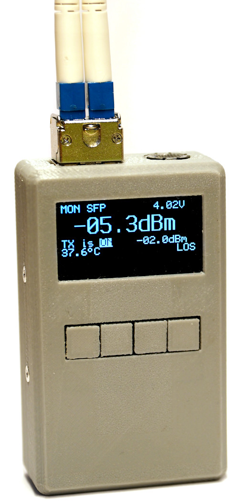
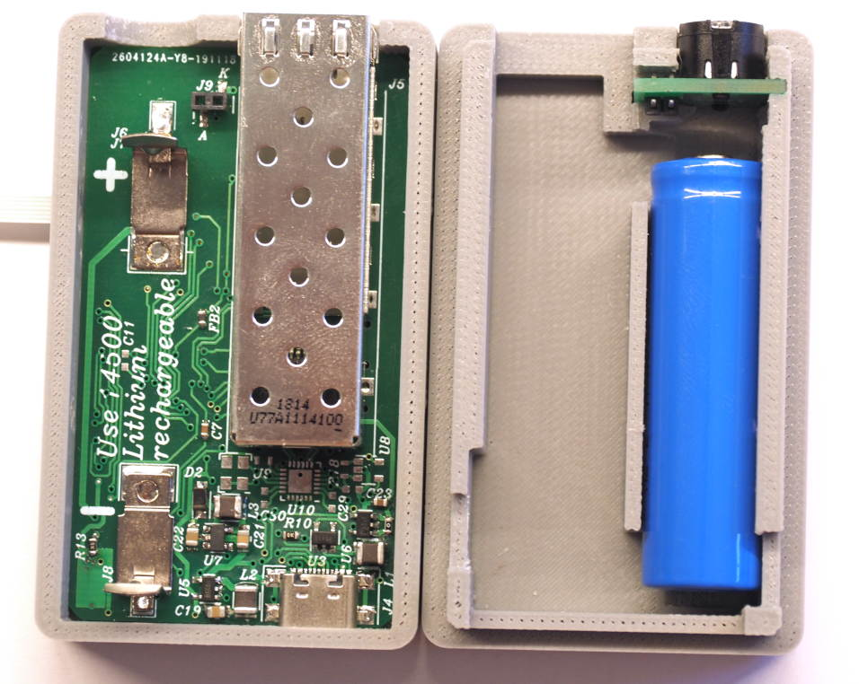

Hubble is a multitool for SFP(+) transceivers. It can read 
identification and monitoring data using the transceiver's I²C-based 
management interface.

This project is still work in progress.

# Features and Facts
- Read SFP(+) transceiver identification data
- Optical transceivers
  - turn laser on/off
  - read optical power (RX and TX)
  - read temperature
- 88E111 based 1000 BASE-T transceivers
  - Detect link
  - Count received frames
  - Cable test (TDR) (work in progress)
- (optionally) PRBS generator and eye diagram monitor (work in progress)
- STM32L412 Cortex-M4 MCU
- 128x64 monochrome OLED
- 4 buttons (Mode, Select, Down, Up)
- USB 2.0 Fullspeed for charging and software upgrade
- 14500 Li-Ion battery
- really bright LED flashlight

# Hardware

## Main board

[Schematics](hw/main/output/schematic.pdf)

## LED Board

[Schematics](hw/led/output/schematic.pdf)

## SWD debug adapter

[Schematics](hw/swd/output/schematic.pdf)

# Disassembled

